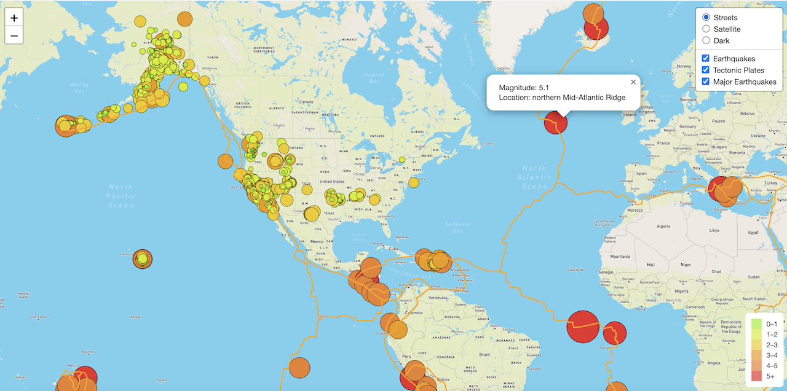
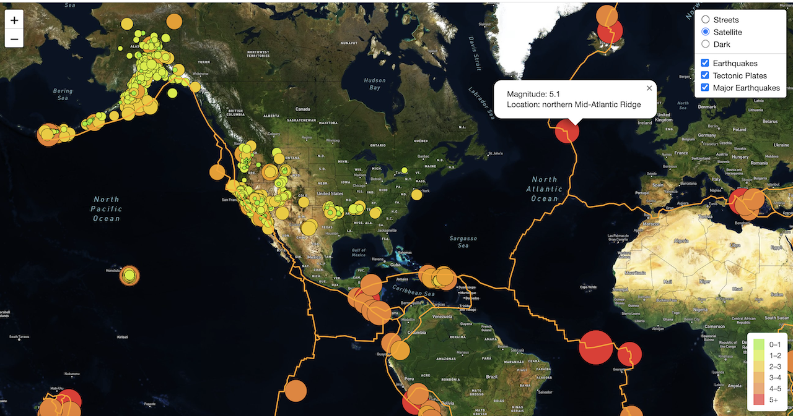
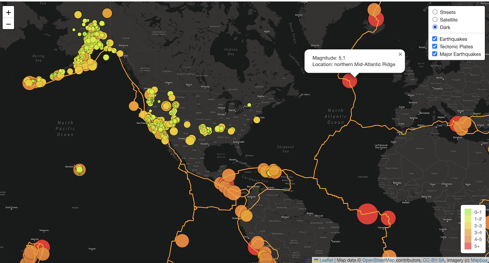

# Mapping_Earthquakes
## Overview of the project
The purpose of the project is to create an interactive map of earthquake data showing the magitudes of earthquakes around the world. The final map shows:
* Three different base maps (Streets, Satellite, Dark) overlaied with earthquake/tectonic plates/major earthquake data, which allow the viewer to choose different maps and toggle off and on the earthquake data.
* The earthquake data in relation to the tectonic plates' location on the earth. 
* All the earthquakes with a magnitude greater than 4.5 on the map.

## Results
Street Layer

Satellite Layer

Dark Layer

